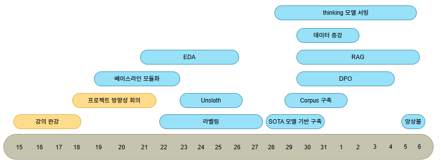

# 수능형 문제 풀이 모델 생성 프로젝트
네이버 부스트 캠프 AI-Tech 8기에서 진행한 NLP 도메인의 두번째 팀 경진대회입니다. 
- 기간 : 2025.12.17(수) - 20256.01.06(화)

## 👩‍🏫 대회 소개
'한국어'와 '시험'이라는 주제에 맞춰서 작은 모델들로 수능 시험을 풀어보는 도전
<br>
수능에 최적화된 모델을 만들어, GPT, Claude, Gemini 같은 대형 모델들을 뛰어넘어 보기

## 👨‍👦‍👦 팀 소개
### 팀 이름
파란 부스터 (NLP-09)


### 팀원 및 역할
| 이름 | 역할  |
| :-: | --- |
| **강다형** | 데이터 라벨링, 가상환경/패키지 설정, qwen3-thinking 모델 서빙, 스크럼 모더레이터 | 
| **김민석** | 모델 탐색 및 파이프라인, 데이터 증강 및 전처리, 데이터 분류 파이프라인, 프롬프트 모듈화 |
| **김세훈** | 데이터 라벨링, Rag corpus구축, 한국사 Rag 파이프라인 설계 |
| **박준범** | 데이터 라벨링, 베이스라인 모듈화, github 초기 셋팅, SFT실험 |
| **이태원** | 데이터 라벨링, 베이스라인 모듈화, 데이터 증강, 앙상블 |
| **허승환** | 팀 notion 설계, EDA, 데이터 라벨링, DPO, CoT, 데이터 생성 |

## ⚙ 환경
- GPU : Linux 기반 원격 GPU(V100 32GB) 서버 3개를 SSH 접속을 통해 활용
- 협업 : Github, Notion, Slack

## 📆 타임 라인


## 📃 주요 구현 기능
### SFT
수능문제 풀이 task에 맞게 추가적으로 instruction tuning
- 데이터 증강 (HAERAE + 9급 공무원 한국사)
- 데이터 전처리 (answer 분포 불균형 완화 및 저품질 샘플 삭제)
- Unsloth + LoRA로 메모리 연산 효율을 확보하며 장문 문맥 반영

### Thinking Model
Qwen3 계열 최신 thinking 모델로 추론 진행
- think 옵션 사용하여 Chain-of-Thought 기반 추론 강화

### RAG
한국사 문제의 경우 외부 지식이 있어야만 문제풀이가 가능하므로 RAG 파이프라인 도입
- 7대 카테고리로 구조화된 한국사 Corpus 구축
- Hybrid (FAISS+BM25) Retreiver 구축
- LLM으로 한국사 문제 분류 후 문서 삽입
### Ensemble
hard voting 진행
- unsloth/Qwen2.5-32B-instruct-bnb-4bit (base + 증강 데이터셋)
- unsloth/Qwen2.5-32B-instruct-bnb-4bit (base 셔플 데이터셋)
- unsloth/Qwen3-30B-A3B-Thinking-2507
- unsloth/Qwen3-30B-A3B-Instruct-2507-GGUF
- LGAI-EXAONE/EXAONE-4.0-32B-AWQ

### 상세 실험 내용
- [랩업 리포트](https://github.com/boostcampaitech8/pro-nlp-generationfornlp-nlp-09/blob/main/asset/%E1%84%89%E1%85%AE%E1%84%82%E1%85%B3%E1%86%BC%E1%84%92%E1%85%A7%E1%86%BC%20%E1%84%86%E1%85%AE%E1%86%AB%E1%84%8C%E1%85%A6%20%E1%84%91%E1%85%AE%E1%86%AF%E1%84%8B%E1%85%B5%20%E1%84%86%E1%85%A9%E1%84%83%E1%85%A6%E1%86%AF%20%E1%84%89%E1%85%A2%E1%86%BC%E1%84%89%E1%85%A5%E1%86%BC%20WRAP-UP%20REPORT.pdf)


## 🏆 최종 성적
- **Public 순위** : **8위** (Macro-F1 : 0.8129) / 16팀

- **Private 순위** : **7위** (Macro-F1 : 0.7403) / 16팀


## 실행 방법
````
# 1. 가상환경 설치
uv pip install -r requirements.txt

# 2. 데이터 전처리
python src/data/data_shuffle.py

# 3. corpus 구축
python 

# 4-1. 학습 실행
python src/run.py mode=train

# 4-2. 평가 실행
python src/run.py mode=evaluate

# 4-3. 추론 실행
python src/run.py mode=inference

# 4. 앙상블 진행
python src/ensemble/hard_voting.py

# 5. thinking 모델 실행
(develop2-inference-only)
uv sync
uv run run_inference.py
````
## 📁 파일 구조
````
main/
├── config/
│   └── config.yaml
├── src/
│   ├── data/
│   │   ├── base_data.py
│   │   ├── baseline_data.py
│   │   └── data_shuffle.py
│   ├── model/
│   │   ├── base_model.py
│   │   ├── baseline_model.py
│   │   └── unsloth_model.py
│   ├── rag/
│   │   ├── base_rag.py
│   │   ├── faiss_index_manager.py
│   │   └── reg_pipeline.py
│   ├── corpus/
│   │   ├── corpus.json
│   │   └── manage_corpus.py
│   ├── retrieval/
│   │   ├── base_retriever.py
│   │   ├── bm25_retriever.py
│   │   ├── ensemble_retriever.py
│   │   └── vector_retriever.py
│   └── run.py
├── analysis/
│   └── test_korean_history_structure.json
├── prompt/
│   ├── base.txt
│   ├── prompt_templates.py
│   └── rag_eval.txt
├── faiss-index/
│   ├── index.faiss
│   └── index.pkl
├── scripts/
├── eda/
├── README.md
├── requirements.txt
└── install.sh
````


